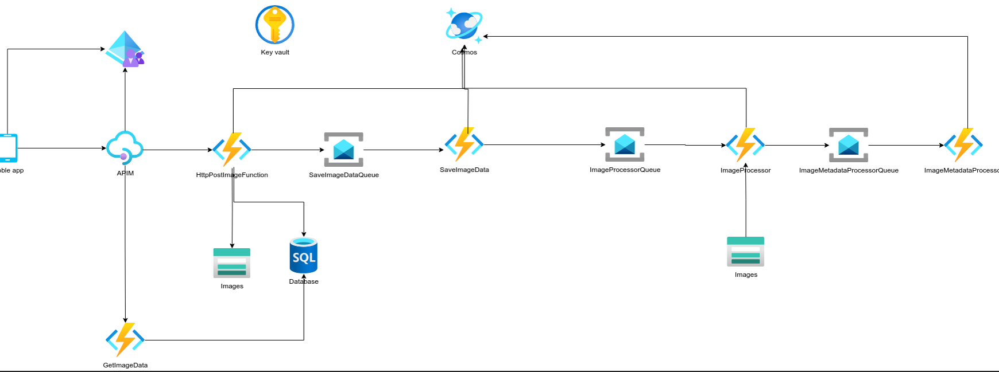
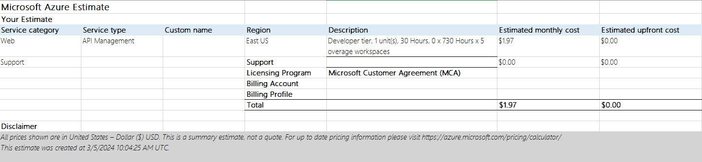

# EcoScan

En el proceso de construcción de la infraestructura para una aplicación móvil, he optado por utilizar Terraform debido a su eficacia y flexibilidad. En particular, he elegido Azure como proveedor de servicios en la nube debido a mi familiaridad con su plataforma y la robustez de sus servicios. Este repositorio contiene los archivos de configuración de Terraform necesarios para implementar y gestionar la infraestructura en Azure.

Es importante tener en cuenta que he excluido deliberadamente las carpetas que contienen archivos de seguridad, como los hashes y los ejecutables, para garantizar la confidencialidad y la integridad de los datos. Sin embargo, todos los archivos de configuración esenciales para establecer y mantener la conexión con Azure están incluidos y son fácilmente accesibles.

Es importante destacar que, por el momento, se establece la conexión para pruebas de casos de uso. Esto permite probar y validar la funcionalidad de la infraestructura en un entorno controlado antes de su implementación completa.

A lo largo de este proceso, mi objetivo es optimizar la infraestructura para garantizar un rendimiento óptimo y una escalabilidad sin problemas para la aplicación móvil. Utilizando Terraform, espero simplificar y automatizar el despliegue y la gestión de recursos en la nube, permitiéndome centrarme en el desarrollo y la mejora continua de la aplicación.

Actualmente, hemos diseñado una arquitectura preliminar que planeamos probar en su mayoría antes de configurarla en este repositorio. Quedan pendientes las pruebas de rendimiento entre servicios, las cuales también serán validadas en futuras instancias aquí.

Además, temporalmente estamos utilizando el Azure Pricing Calculator para estimar costos y realizar un presupuesto. Destacamos el costo de APIM, una de las primeras partes a implementar en la infraestructura.

Para el trabajo en equipo, planeamos utilizar Azure DevOps, aunque esta decisión podría cambiar dependiendo de la infraestructura final elegida, siempre que sea justificada. Por ahora, nuestro espacio en EcoScan en Azure DevOps está en fase inicial, con la inclusión de todos los miembros del equipo a la espera de la aprobación de las partes interesadas."